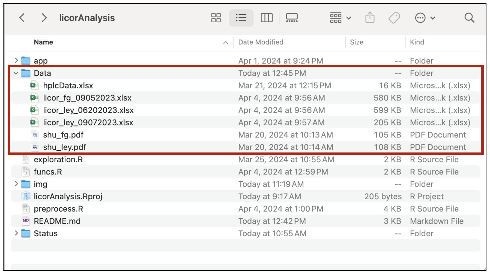

<!-- PROJECT LOGO AND INTRO SECTION -->
<br />
<div align="center">
  <a href="https://github.com/lilynorthcutt/licorAnalysis">
    
  </a>

  <h3 align="center">Analysis of Pepper SHU in Response to Stress</h3>

  <p align="center">
    This project is a part of the New Mexico State (NMSU) Chile Pepper Institute's (CPI) research program, and is        built in R to understand underlying relationships between stress and capsaicin content in New Mexico.
    <br />
    :hot_pepper:
    <br />
    <br />
    <a href="https://cpi.nmsu.edu">CPI Homepage</a> 
    ·
    <a href="https://chilebreeding.nmsu.edu/index.html">Chile Breeding Program</a>
  </p>
  
</div>

<details open>
<summary>Table of Contents</summary>

- [About The Project](#about-the-project)
- [Getting Started](#getting-started)
   * [Pre-Requisites](#pre-requisites)
   * [Installation Instructions](#installation-instructions)
   * [Running the Code](#running-the-code)
- [Data](#data)
   * [Data Sources](#data-sources)
- [Acknowledgements/References](#acknowledgementsreferences)
</details>


<!-- About The Project -->
## About The Project 

We are looking at plant porometry, fluorometry, plant yield/maturity, and environmental factor data to gain better insight into the scoville heat unit (SHU) in new mexican chile peppers. The goal is to understand how SHU is affected by looking at the following: 

* Environmental data such as weather and altitude
* The plants stress response (taken using LICOR LI600)
* The quality of yield - fruit weight, color, fruit maturity, yield quantity. 

Understanding these relationships will better aid farmers and researchers in all of their spicy endeavors, whether it be breeding the worlds hottest pepper, or simply maintaining a constant heat level in their harvest.


<!-- GETTING STARTED -->
## Getting Started

This project is fairly contained, with minimal setup. However, due to the proprietary nature of the data, the data is not stored on  github. The instructions for NMSU CPI researchers data access is described below.

### Pre-Requisites
The code is entirely based in R, using SQL to query environmental data.

- **Editor Used**: RStudio version 2023.12.1
- **R Version**: R version 4.3.3


### Installation Instructions
Below are the instructions to setup up and run the project locally:

1. Clone the repo 

  ```bash
  git clone https://github.com/lilynorthcutt/licorAnalysis.git
  ```
2. Request access to the LICOR project through Dr. Dennis Lozada. 
3. Navigate to the files in the LICOR project and copy the `Data` folder
4. Paste the `Data` folder into the main directory of the project
<div align="center">
</br>
  <a href="https://github.com/lilynorthcutt/licorAnalysis">
      
  </a>
</div>

>:warning: **Do not change the file names within `Data`**: The code is dependent on the filenames remaining the same!

### Running the Code
Depending on your need for the code, how you will run it will vary. Here are some possible use cases:

1. **Visualizing Data in App**: To run the RShiny application and view the data, graphs, and analysis without 
interacting with the code, navigate to the `app` folder, select `ui.R`, `server.R`, or `global.R`, and press `Run App`. You should now be able to play around with the interactive visualizations. 
2. **Contributing to Code**: To add/modify how the data is read in, cleaning/wrangling, feature engineering or anything similar, access the `preprocessing.R` file. To edit the training process, add models, change parameters, or anything similar, access the `training.R` file. To modify/edit the model evaluation or anything similar, access the `results.R` file. The `main.R` file runs everything together, and the files in the RShiny app are found in the `app` folder. Finally, many functions that are used throughout the files previously mentioned can be found in the `funcs.R` file.
3. _**Updating in Real-Time** (:grey_exclamation: not currently implemented)_: We would like to have the code setup such that we can directly input data collected the same day, and view results. This feature is not currently implemented.

## Data
Much of the LICOR data used in this project is proprietary and belongs to NMSU, if access is granted, researcher must add the data locally to run the code. 

### Data Sources
This project uses four data sources:

1. **Porometry/Fluorometry Data**: Using <a href="https://www.licor.com/env/products/LI-600/">LI-COR LI-600</a> data, such as stomatal conductance, transpiration, leaf vapor pressure, fluorescence, etc. is collected. A full data dictionary of LI-600 output can be found <a href="https://www.licor.com/env/support/LI-600/topics/data-file-descriptions.html#Datafilestructure">here</a>. Data was collected at 2 different locations on 3 separate days for 20 genotypes for 3 replications. _Additional information is located in the powerpoint found under `Project Overview and Status/LICOR Project Overview.pptx`.
2. **Scoville Heat Unit (SHU) Data**: Peppers from 5 different plants in each replication for each genotype at both locations are sampled, dried, ground, and assessed by high-performance liquid chromatography (HPLC) to quantitatively measure SHU. 
3. **Harvest Data**: At the time of harvesting mature fruit, additional data is taken by researchers. This includes number of plants harvested, harvest date, yield (mature vs. non-mature), and pod weight. 
4. **Environmental Data**: Weather data and environmental factors are our fourth and final data source. The data is queried using the National Weather Service's API, more information can be found <a href="https://www.weather.gov/documentation/services-web-api">here</a>.


## Acknowledgements/References
Thank you to the folks on the <a href="https://chilebreeding.nmsu.edu/team.html">Spicy Team</a> at NMSU CPI for their diligent and thorough assistance in
collecting and preparing data for this project. Without their contributions this project would not be possible.

<div align="center">
  </br>
  </br>
  </br>
  <a href="https://github.com/lilynorthcutt/licorAnalysis">
    
  </a>
</div>
